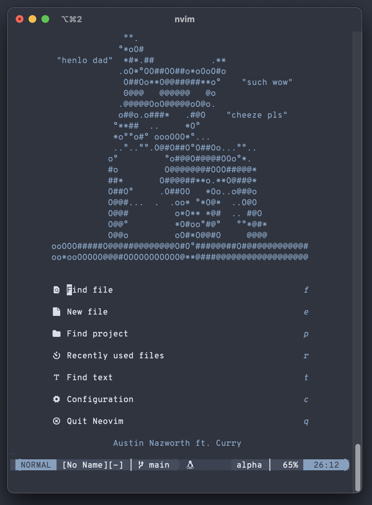

# Neovim-Curry
## Neovim, the Curry edition
This is my own personal Neovim configuration, inspired by my dog Curry. I've
kept things lightweight and simple while still maintaining useful features such
as LSP functionality and Github Copilot, which I use in my day-to-day work.
Feel free to try it out for yourself or make suggestions, I'd love to hear
feedback.




# Prerequisites
- Make sure you have the latest version of [Neovim](https://github.com/neovim/neovim) installed.

- Make sure you have a proper [Nerd Font](https://nerdfonts.com) installed and enabled in your terminal.

- Remove your current Neovim directory. I recommend not fully deleting it, just in case you decide to revert back to Neovim's default configuration.

# Installation
Run the following command in your terminal emulator to clone Neovim-Curry into your nvim directory.

```
git clone https://github.com/anazworth/Neovim-Curry.git ~/.config/nvim
```

In your terminal emulator, run 'nvim'. Then, in nvim, type```:PlugInstall``` 

If you do not have access to Github Copilot, you can go to "init.vim" and comment out
```
Plug "github/copilot.vim"
```

### Optional

- To enable Neovim node support

```
npm i -g neovim
```

- To enable Neovim python support

```
pip install pynvim
```

### Theme

I use [Nord theme](https://www.nordtheme.com).
- To change the theme to your liking, replace the following line found in "init.vim" with your favorite theme.

```
colorscheme <your theme name>
```
